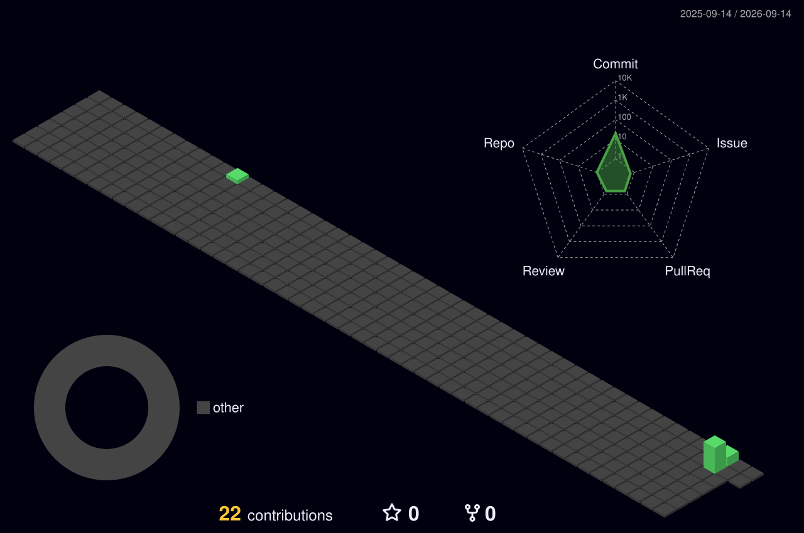
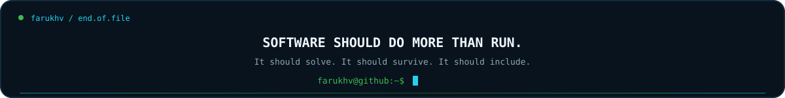

<!--
  farukhv / README.interface
  If you opened the source, you are exactly the kind of person I like building with.
-->

<p align="center">
  
</p>

<div align="center">

<a href="mailto:mfarukmenek@gmail.com"></a>


</div>

---

<table>
<tr>
<td width="145" align="center" valign="middle">

<br/><br/>
<code>@farukhv</code>
</td>
<td valign="middle">

### `> identity --resolve`

**Muhammed Faruk Menek** — Computer Engineering student and developer from Türkiye.

I build around one question: **does this become useful outside the demo?**

My work sits where `accessibility`, `software architecture`, `AI`, `automation` and `secure engineering` meet.

</td>
</tr>
</table>

## `command.palette`

> These are real expandable sections. Pick a command.

<details>
<summary><code>▶ whoami --verbose</code></summary>

<br/>

```yaml
identity:
  role: Computer Engineering Student / Developer
  mode: builder
  location: Türkiye

focus:
  - accessibility-first systems
  - applied artificial intelligence
  - backend & software architecture
  - automation
  - secure-by-design engineering

rule:
  "technology matters when people can actually use it"
```

I care about what happens **after the code works**: deployment, maintainability, security, accessibility and real users.

</details>

<details>
<summary><code>▶ stack --inspect</code></summary>

<br/>

**Build**  
`React` · `TypeScript` · `JavaScript` · `Node.js` · `NestJS` · `PostgreSQL`

**Operate**  
`Docker` · `Linux` · `Git` · `GitHub Actions`

**Think**  
`Architecture` · `Accessibility` · `Security` · `Automation` · `AI`

<p align="center">
  
</p>

</details>

<details>
<summary><code>▶ philosophy.txt</code></summary>

<br/>

> **Accessibility is architecture.** Not decoration.
>
> **Security is a design decision.** Not a patch.
>
> **Deployment is development.** Local success is not production success.
>
> **Complexity should earn its place.**

</details>

<details open>
<summary><code>▼ selected-work --showcase</code></summary>

<br/>

<table>
<tr>
<td width="33%" valign="top">

### ♿ Accessibility Systems

Automated inspection, scoring and reporting around digital accessibility.

`WCAG 2.2` `Automation` `Reporting`

[**case study →**](./showcase/accessibility-systems.md)

</td>
<td width="33%" valign="top">

### 🛰️ Mars Rover Edge AI

Edge-first scientific filtering and AI-assisted anomaly analysis for rover sensor/camera data.

`Python` `AI` `Edge Computing`

[**case study →**](./showcase/mars-rover-edge-ai.md)

</td>
<td width="33%" valign="top">

### 🏠 Full-Stack Platform

Production-oriented property platform across UI, API, auth, data and deployment.

`React` `TypeScript` `REST` `Prisma`

[**case study →**](./showcase/real-estate-platform.md)

</td>
</tr>
</table>

<p align="right"><a href="./showcase/README.md">open engineering showcase →</a></p>

</details>

---

## `live.contributions // generated from GitHub`

<p align="center">
  
</p>

<details>
<summary><code>▶ why this is different</code></summary>

<br/>

This visualization is **not a decorative mockup**. A GitHub Action regenerates it from contribution data every day and after profile updates.

</details>

## `activity.stream`

<p align="center">
  <picture>
    <source media="(prefers-color-scheme: dark)" srcset="https://raw.githubusercontent.com/farukhv/farukhv/output/github-snake-dark.svg" />
    <source media="(prefers-color-scheme: light)" srcset="https://raw.githubusercontent.com/farukhv/farukhv/output/github-snake.svg" />
    
  </picture>
</p>

---

## `current.processes`

```text
PID   PROCESS                         STATE
101   accessible-systems              BUILDING
202   applied-ai                      EXPERIMENTING
303   software-architecture           LEARNING + SHIPPING
404   unnecessary-complexity          NOT FOUND
```

<details>
<summary><code>▶ ./open interests/</code></summary>

<br/>

```text
technology/
├── artificial-intelligence
├── cybersecurity
├── accessible-technology
├── software-architecture
├── automation
├── aviation
└── space

outside-code/
├── music
├── learning
├── exploring
└── building-things-because-can-this-be-done
```

</details>

---

## `connect`

```console
farukhv@github:~$ ./connect --open

→ interesting engineering problems
→ accessibility projects
→ AI experiments
→ open-source collaboration
→ ambitious ideas that need to become real systems
```

<div align="center">
<a href="mailto:mfarukmenek@gmail.com"></a>
<a href="https://github.com/farukhv"></a>
</div>

<br/>

<p align="center">
  
</p>
