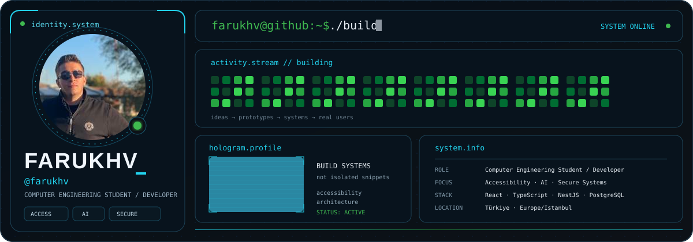
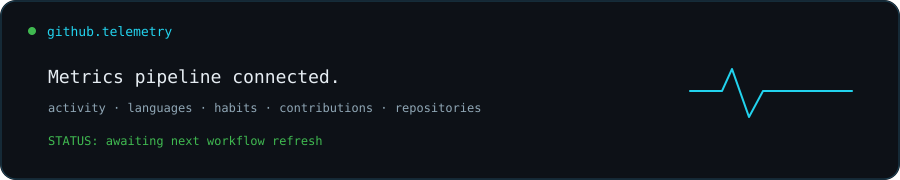

<!--
  farukhv / profile.system
  You opened the source. Good.
  Curiosity is usually where engineering starts.
-->

<p align="center">
  
</p>

<div align="center">

<a href="mailto:mfarukmenek@gmail.com"></a>


</div>

---

## `01 // whoami`

```yaml
identity:
  name: Muhammed Faruk Menek
  handle: farukhv
  role: Software Engineering Student / Developer
  location: Türkiye

focus:
  - accessible digital systems
  - software architecture
  - artificial intelligence
  - automation
  - secure engineering

principles:
  accessibility: architecture, not decoration
  security: by design
  complexity: justify it
  deployment: part of development
  mission: build systems people can actually use
```

I am interested in software that survives the distance between **prototype** and **real use**.

That means thinking about architecture, accessibility, security, deployment and maintainability — not only whether the code runs.

---

## `02 // system.identity`

<table>
<tr>
<td width="25%" align="center" valign="top">

### `ENGINEER`

Systems before snippets.

Architecture, APIs, data and deployment.

</td>
<td width="25%" align="center" valign="top">

### `ACCESS`

Accessibility belongs in the architecture.

Not at the end of the checklist.

</td>
<td width="25%" align="center" valign="top">

### `SECURE`

Security is a design decision.

Not a patch after release.

</td>
<td width="25%" align="center" valign="top">

### `EXPLORE`

AI, automation and unfamiliar problems.

Curiosity is part of the stack.

</td>
</tr>
</table>

---

## `03 // currently.building`

<table>
<tr>
<td width="50%" valign="top">

### ♿ Accessible Digital Systems

Designing and developing systems where accessibility is treated as a core product requirement.

`WCAG 2.2` `Accessible UX` `Web Systems` `Automation`

</td>
<td width="50%" valign="top">

### ◉ Accessibility Analysis

Exploring automated inspection, scoring and reporting flows for digital accessibility problems.

`Analysis` `Automation` `Reporting` `Web`

</td>
</tr>
<tr>
<td width="50%" valign="top">

### ◈ Applied AI

Experimenting with AI where it can remove repetitive work, improve decisions or create better interaction patterns.

`AI` `Integration` `Automation` `Experiments`

</td>
<td width="50%" valign="top">

### ◇ Software Architecture

Working across backend services, authentication, databases, APIs, deployment and maintainability.

`Backend` `Architecture` `Security` `Infrastructure`

</td>
</tr>
</table>

---

## `04 // engineering.dna`

```text
                            IDEA
                             │
                             ▼
                         ENGINEER
                             │
              ┌──────────────┼──────────────┐
              ▼              ▼              ▼
        ACCESSIBILITY     SECURITY          AI
              │              │              │
              └──────────────┼──────────────┘
                             ▼
                            SHIP
                             │
                             ▼
                         REAL USERS
```

### Build

`React` · `TypeScript` · `JavaScript` · `Node.js` · `NestJS` · `PostgreSQL`

### Operate

`Docker` · `Linux` · `Git` · `GitHub Actions`

### Think

`Software Architecture` · `Accessibility` · `Security` · `Automation` · `Artificial Intelligence`

<p align="center">
  
</p>

<details>
<summary><code>▶ ./inspect --engineering-profile</code></summary>

<br />

**Frontend**  
React · TypeScript · JavaScript · HTML · CSS

**Backend**  
Node.js · NestJS · REST APIs · PostgreSQL

**Infrastructure**  
Docker · Linux · GitHub Actions · deployment workflows

**Engineering interests**  
Accessibility · secure systems · automation · artificial intelligence · system architecture

</details>

---

## `05 // engineering.philosophy`

> **Accessibility is architecture.**  
> Not decoration.

> **Security is a design decision.**  
> Not a patch.

> **Deployment is part of development.**  
> Software that only works locally is unfinished work.

> **Complexity should earn its place.**

> **Technology matters when people can actually use it.**

---

## `06 // work.log`

```text
farukhv@github:~$ ./inspect --work
```

I prefer projects that move beyond *“it works”* toward:

```text
idea
  │
  ▼
prototype
  │
  ▼
architecture
  │
  ▼
implementation
  │
  ▼
security
  │
  ▼
accessibility
  │
  ▼
deployment
  │
  ▼
real users
```

That final step changes everything.

---

## `07 // github.telemetry`

<p align="center">
  
</p>

---

## `08 // contribution.stream`

<p align="center">
  <picture>
    <source media="(prefers-color-scheme: dark)" srcset="https://raw.githubusercontent.com/farukhv/farukhv/output/github-snake-dark.svg" />
    <source media="(prefers-color-scheme: light)" srcset="https://raw.githubusercontent.com/farukhv/farukhv/output/github-snake.svg" />
    
  </picture>
</p>

---

## `09 // beyond.code`

<details>
<summary><code>▶ ./open interests/</code></summary>

<br />

```text
technology/
├── artificial-intelligence
├── cybersecurity
├── accessible-technology
├── software-architecture
├── automation
├── aviation
└── space

life/
├── music
├── learning
├── building
└── exploring
```

Sometimes a project starts because there is a clear need.

Sometimes this is enough:

```text
"Can this be done?"
```

</details>

---

## `10 // connection`

```text
farukhv@github:~$ ./connect

looking for:
  → interesting engineering problems
  → accessibility projects
  → open-source collaboration
  → AI experiments
  → ambitious ideas

status:
  accepting packets █
```

<div align="center">

<a href="mailto:mfarukmenek@gmail.com"></a>
<a href="https://github.com/farukhv"></a>

</div>

---

<div align="center">

### `SOFTWARE SHOULD DO MORE THAN RUN.`

**It should solve. It should survive. It should include.**

`farukhv@github:~$ █`

</div>
